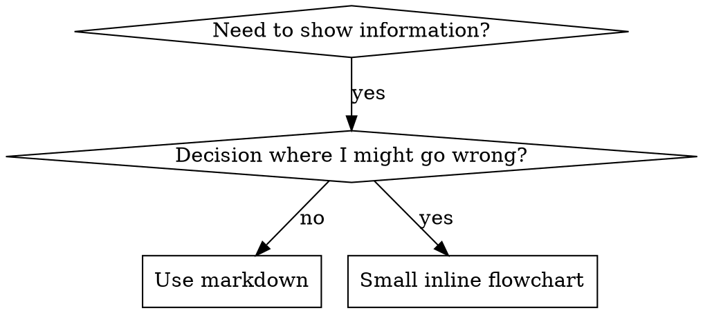

# Writing Skills

## Overview

**Writing skills IS Test-Driven Development applied to process documentation.**

**Personal skills live in your runtime's skills directory** — on OpenCode, the project's `skills/` directory or `<home>/.config/opencode/skills/`.

You write test cases (pressure scenarios with subagents), watch them fail (baseline behavior), write the skill (documentation), watch tests pass (agents comply), and refactor (close loopholes).

**Core principle:** If you didn't watch an agent fail without the skill, you don't know if the skill teaches the right thing.

**REQUIRED BACKGROUND:** You MUST understand skillful:test-driven-development before using this skill. That skill defines the fundamental RED-GREEN-REFACTOR cycle. This skill adapts TDD to documentation.

## What is a Skill?

A **skill** is a reference guide for proven techniques, patterns, or tools. Skills help future agents find and apply effective approaches.

**Skills are:** Reusable techniques, patterns, tools, reference guides
**Skills are NOT:** Narratives about how you solved a problem once

## TDD Mapping for Skills

| TDD Concept | Skill Creation |
|-------------|----------------|
| **Test case** | Pressure scenario with subagent |
| **Production code** | Skill document (SKILL.md) |
| **Test fails (RED)** | Agent violates rule without skill (baseline) |
| **Test passes (GREEN)** | Agent complies with skill present |
| **Refactor** | Close loopholes while maintaining compliance |
| **Write test first** | Run baseline scenario BEFORE writing skill |
| **Watch it fail** | Document exact rationalizations agent uses |
| **Minimal code** | Write skill addressing those specific violations |
| **Watch it pass** | Verify agent now complies |
| **Refactor cycle** | Find new rationalizations → plug → re-verify |

The entire skill creation process follows RED-GREEN-REFACTOR.

## When to Create a Skill

**Create when:**
- Technique wasn't intuitively obvious to you
- You'd reference this again across projects
- Pattern applies broadly (not project-specific)
- Others would benefit

**Don't create for:**
- One-off solutions
- Standard practices well-documented elsewhere
- Project-specific conventions (put in your instructions file)
- Mechanical constraints (if it's enforceable with regex/validation, automate it—save documentation for judgment calls)

## Skill Types

### Technique
Concrete method with steps to follow (condition-based-waiting, root-cause-tracing)

### Pattern
Way of thinking about problems (flatten-with-flags, test-invariants)

### Reference
API docs, syntax guides, tool documentation (office docs)

## Directory Structure

```
skills/
  skill-name/
    SKILL.md              # Main reference (required)
    supporting-file.*     # Only if needed
```

**Flat namespace** - all skills in one searchable namespace

**Separate files for:**
1. **Heavy reference** (100+ lines) - API docs, comprehensive syntax
2. **Reusable tools** - Scripts, utilities, templates

**Keep inline:**
- Principles and concepts
- Code patterns (< 50 lines)
- Everything else

## SKILL.md Structure

**Frontmatter (YAML):**
- Two required fields: `name` and `description`
- Max 1024 characters total
- `name`: Use letters, numbers, and hyphens only (no parentheses, special chars)
- `description`: Third-person, describes ONLY when to use (NOT what it does)
  - Start with "Use when..." to focus on triggering conditions
  - Include specific symptoms, situations, and contexts
  - **NEVER summarize the skill's process or workflow**
  - Keep under 500 characters if possible

```markdown
---
name: Skill-Name-With-Hyphens
description: Use when [specific triggering conditions and symptoms]
---

# Skill Name

## Overview
What is this? Core principle in 1-2 sentences.

## When to Use
Bullet list with SYMPTOMS and use cases
When NOT to use

## Core Pattern (for techniques/patterns)
Before/after code comparison

## Quick Reference
Table or bullets for scanning common operations

## Implementation
Inline code for simple patterns
Link to file for heavy reference or reusable tools

## Common Mistakes
What goes wrong + fixes
```

## Skill Discovery Optimization (SDO)

### 1. Rich Description Field

**Purpose:** Your agent reads the description to decide which skills to load for a given task. Make it answer: "Should I read this skill right now?"

**Format:** Start with "Use when..." to focus on triggering conditions

**CRITICAL: Description = When to Use, NOT What the Skill Does**

The description should ONLY describe triggering conditions. Do NOT summarize the skill's process or workflow in the description.

```yaml
# ❌ BAD: Summarizes workflow - agents may follow this instead of reading skill
description: Use when executing plans - dispatches subagent per task with code review between tasks

# ❌ BAD: Too much process detail
description: Use for TDD - write test first, watch it fail, write minimal code, refactor

# ✅ GOOD: Just triggering conditions, no workflow summary
description: Use when executing implementation plans with independent tasks in the current session

# ✅ GOOD: Triggering conditions only
description: Use when implementing any feature or bugfix, before writing implementation code
```

**Content:**
- Use concrete triggers, symptoms, and situations that signal this skill applies
- Describe the *problem* not *language-specific symptoms*
- Keep triggers technology-agnostic unless the skill itself is technology-specific
- Write in third person
- **NEVER summarize the skill's process or workflow**

```yaml
# ❌ BAD: Too abstract, vague, doesn't include when to use
description: For async testing

# ❌ BAD: First person
description: I can help you with async tests when they're flaky

# ❌ BAD: Mentions technology but skill isn't specific to it
description: Use when tests use setTimeout/sleep and are flaky

# ✅ GOOD: Starts with "Use when", describes problem, no workflow
description: Use when tests have race conditions, timing dependencies, or pass/fail inconsistently

# ✅ GOOD: Technology-specific skill with explicit trigger
description: Use when using React Router and handling authentication redirects
```

### 2. Keyword Coverage

Use words an agent would search for:
- Error messages: "Hook timed out", "ENOTEMPTY", "race condition"
- Symptoms: "flaky", "hanging", "zombie", "pollution"
- Synonyms: "timeout/hang/freeze", "cleanup/teardown/afterEach"
- Tools: Actual commands, library names, file types

### 3. Descriptive Naming

**Use active voice, verb-first:**
- ✅ `creating-skills` not `skill-creation`
- ✅ `condition-based-waiting` not `async-test-helpers`

### 4. Token Efficiency (Critical)

**Target word counts:**
- getting-started workflows: <150 words each
- Frequently-loaded skills: <200 words total
- Other skills: <500 words (still be concise)

**Techniques:**
- Move details to tool help
- Use cross-references
- Compress examples
- Eliminate redundancy

**Verification:**
```bash
wc -w skills/path/SKILL.md
```

### 5. Cross-Referencing Other Skills

**When writing documentation that references other skills:**

Use skill name only, with explicit requirement markers:
- ✅ Good: `**REQUIRED SUB-SKILL:** Use skillful:test-driven-development`
- ✅ Good: `**REQUIRED BACKGROUND:** You MUST understand skillful:systematic-debugging`
- ❌ Bad: `See skills/testing/test-driven-development` (unclear if required)

## Flowchart Usage



**Use flowcharts ONLY for:**
- Non-obvious decision points
- Process loops where you might stop too early
- "When to use A vs B" decisions

**Never use flowcharts for:**
- Reference material → Tables, lists
- Code examples → Markdown blocks
- Linear instructions → Numbered lists

## RED-GREEN-REFACTOR for Skills

Follow the TDD cycle:

### RED: Write Failing Test (Baseline)

Run pressure scenario with subagent WITHOUT the skill. Document exact behavior:
- What choices did they make?
- What rationalizations did they use (verbatim)?
- Which pressures triggered violations?

This is "watch the test fail" — you must see what agents naturally do before writing the skill.

### GREEN: Write Minimal Skill

Write skill that addresses those specific rationalizations. Don't add extra content for hypothetical cases.

Run same scenarios WITH skill. Agent should now comply.

### REFACTOR: Close Loopholes

Agent found new rationalization? Add explicit counter. Re-test until bulletproof.

## Bulletproofing Skills Against Rationalization

Skills that enforce discipline (like TDD) need to resist rationalization.

### Close Every Loophole Explicitly

Don't just state the rule - forbid specific workarounds:

<Bad>
```markdown
Write code before test? Delete it.
```
</Bad>

<Good>
```markdown
Write code before test? Delete it. Start over.

**No exceptions:**
- Don't keep it as "reference"
- Don't "adapt" it while writing tests
- Don't look at it
- Delete means delete
```
</Good>

### Address "Spirit vs Letter" Arguments

Add foundational principle early:

```markdown
**Violating the letter of the rules is violating the spirit of the rules.**
```

### Build Rationalization Table

Capture rationalizations from baseline testing. Every excuse agents make goes in the table:

```markdown
| Excuse | Reality |
|--------|---------|
| "Too simple to test" | Simple code breaks. Test takes 30 seconds. |
| "I'll test after" | Tests passing immediately prove nothing. |
```

### Create Red Flags List

Make it easy for agents to self-check when rationalizing:

```markdown
## Red Flags - STOP and Start Over

- Code before test
- "I already manually tested it"
- "Tests after achieve the same purpose"
- "It's about spirit not ritual"
- "This is different because..."

**All of these mean: Delete code. Start over with TDD.**
```

### Update SDO for Violation Symptoms

Add to description: symptoms of when you're ABOUT to violate the rule:

```yaml
description: use when implementing any feature or bugfix, before writing implementation code
```

## Match the Form to the Failure

Before writing guidance, classify the baseline failure. The form that bulletproofs one failure type measurably backfires on another.

| Baseline failure | Right form | Wrong form |
|---|---|---|
| Skips/violates a rule under pressure | Prohibition + rationalization table + red flags | Soft guidance ("prefer...", "consider...") |
| Complies, but output has the wrong shape | Positive recipe or contract: state what the output IS | Prohibition list ("don't restate", "never narrate") |
| Omits a required element from something they already produce | Structural: REQUIRED field or slot in the template | Prose reminders near the template |
| Behavior should depend on a condition | Conditional keyed to an observable predicate | Unconditional rule + exemption clauses |

## Common Rationalizations for Skipping Testing

| Excuse | Reality |
|--------|---------|
| "Skill is obviously clear" | Clear to you ≠ clear to other agents. Test it. |
| "It's just a reference" | References can have gaps, unclear sections. Test retrieval. |
| "Testing is overkill" | Untested skills have issues. Always. |
| "I'm confident it's good" | Overconfidence guarantees issues. Test anyway. |
| "No time to test" | Deploying untested skill wastes more time fixing it later. |

**All of these mean: Test before deploying. No exceptions.**

## Anti-Patterns

### ❌ Narrative Example
"In session 2025-10-03, we found empty projectDir caused..."
**Why bad:** Too specific, not reusable

### ❌ Multi-Language Dilution
example-js.js, example-py.py, example-go.go
**Why bad:** Mediocre quality, maintenance burden

### ❌ Code in Flowcharts
```dot
step1 [label="import fs"];
step2 [label="read file"];
```
**Why bad:** Can't copy-paste, hard to read

## The Iron Law (Same as TDD)

```
NO SKILL WITHOUT A FAILING TEST FIRST
```

This applies to NEW skills AND EDITS to existing skills.

Write skill before testing? Delete it. Start over.
Edit skill without testing? Same violation.

**No exceptions:**
- Not for "simple additions"
- Not for "just adding a section"
- Not for "documentation updates"
- Don't keep untested changes as "reference"

**REQUIRED BACKGROUND:** The skillful:test-driven-development skill explains why this matters. Same principles apply to documentation.

## Skill Creation Checklist

**IMPORTANT: Create a todo for EACH checklist item below.**

**RED Phase - Write Failing Test:**
- [ ] Create pressure scenarios
- [ ] Run scenarios WITHOUT skill - document baseline behavior verbatim
- [ ] Identify patterns in rationalizations/failures

**GREEN Phase - Write Minimal Skill:**
- [ ] Name uses only letters, numbers, hyphens
- [ ] YAML frontmatter with required `name` and `description` fields
- [ ] Description starts with "Use when..." and includes specific triggers/symptoms
- [ ] Description written in third person
- [ ] Keywords throughout for search (errors, symptoms, tools)
- [ ] Clear overview with core principle
- [ ] Address specific baseline failures identified in RED
- [ ] Guidance form matches the failure type
- [ ] Run scenarios WITH skill - verify agents now comply

**REFACTOR Phase - Close Loopholes:**
- [ ] Identify NEW rationalizations from testing
- [ ] Add explicit counters (if discipline skill)
- [ ] Build rationalization table from all test iterations
- [ ] Create red flags list
- [ ] Re-test until bulletproof

**Quality Checks:**
- [ ] Small flowchart only if decision non-obvious
- [ ] Quick reference table
- [ ] Common mistakes section
- [ ] No narrative storytelling
- [ ] Supporting files only for tools or heavy reference

**Deployment:**
- [ ] Commit skill to git and push (if configured)
- [ ] Consider contributing back via PR (if broadly useful)
